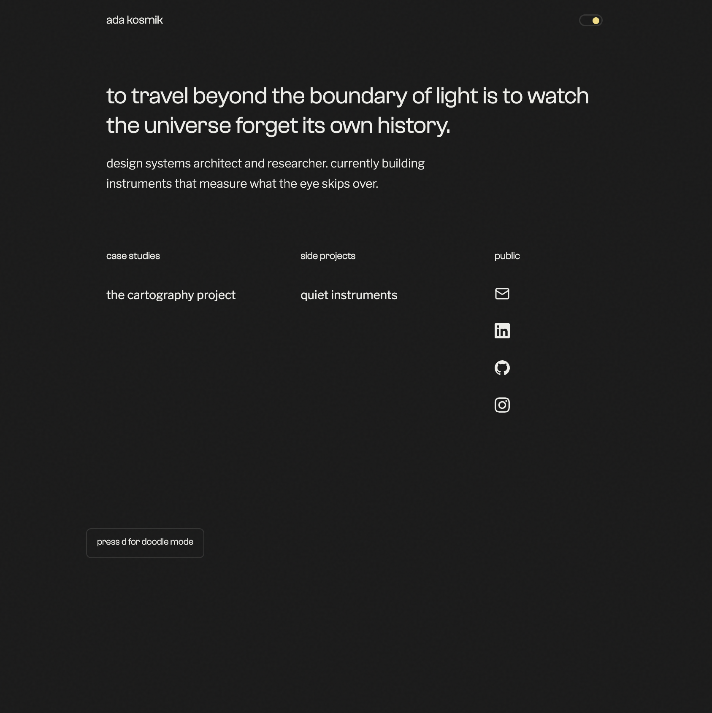
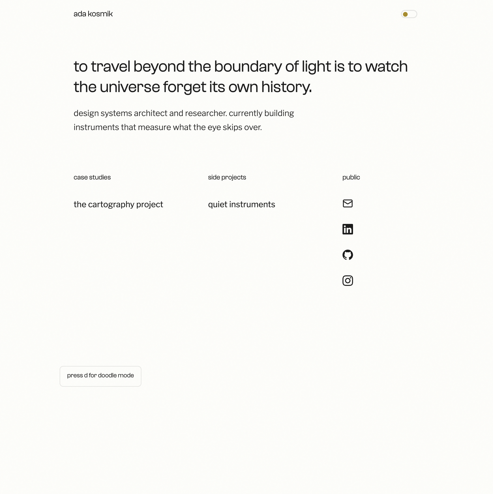
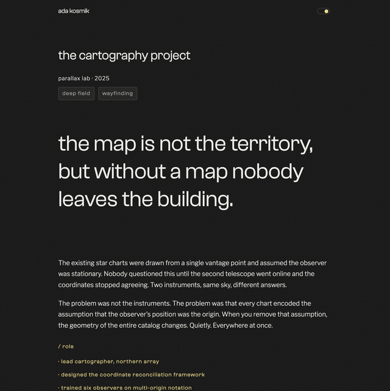

# portfolio kit

ai-native portfolio template and toolkit. 

this is a flexible, content-driven minimalist astro site template paired with skills and agent context that work together out of the box. fork it, open it in a project with your agent (i'd recommend cursor or claude), and the ai already knows how the site works, can help you write case studies, and does a pretty good job of holding back the slop. 

product managers, design operations, product operations, devex, program managers, production managers ...i made this for you. the case study skill is designed to work with atypical content, data and storytelling.

**[live demo →](https://van-thurm.github.io/portfolio-kit/)**

## design

clash grotesk headings, libre franklin body, or update with your own design ideas - easy to swap in new options for things like small accents, light/dark mode and the doodle interaction specs. 

visually restrained so that your content keeps the reader's full attention. 

<p>
  
  
  
</p>

case study layout with hero text, tag system, two-column sections, and stat rows.

## quickstart

```bash
# fork or clone this repo, then:
npm install
npm run dev
```

open `src/data/site.ts` and replace the placeholder values with your own name, links, and bio.

## customize

**identity**: edit `src/data/site.ts` -- name, URL, motto, bio, social links, footer text. every component reads from here.

**add a case study**: create a new `.astro` file in `src/pages/`, use `CaseStudyLayout`, and add a matching entry to `src/data/entries.ts`. Or tell the ai "add a new case study about [project]" and it will scaffold the right file with the right structure.

**add a side project**: same idea, but use `BaseLayout` directly. See `example-project.astro` for the pattern.

**styling**: the design system lives in `src/styles/global.css` (tokens, type, spacing, dark mode) and `src/styles/case-study.css` (all case study components). change the `--spot` color to shift the accent across the whole site. 

**doodle mode tool**: the drawing overlay is included by default on pages that use BaseLayout. Pass `doodle={false}` to disable it on any page.

## file structure

```
src/
  data/
    site.ts            ← your identity and links (edit this first)
    entries.ts         ← directory of all work
    writing.ts         ← external writing links
    bookmarks.ts       ← bookmarks and quotes
  layouts/
    BaseLayout.astro   ← page shell (meta, fonts, theme, doodle)
    CaseStudyLayout.astro ← case study wrapper (hero, tags, footer)
  components/
    SiteHeader.astro   ← sticky header
    Directory.astro    ← home page listing
    DoodleTool.astro   ← drawing overlay
  styles/
    global.css         ← design tokens
    case-study.css     ← case study components
  pages/
    index.astro        ← home
    contact.astro      ← contact
    tag/[tag].astro    ← tag index
    example-case-study.astro  ← example (delete when you add your own)
    example-project.astro     ← example (delete when you add your own)
```

## bundled skills

These live in `.cursor/skills/` and activate automatically when you open the project in cursor.

**portfolio-case-study** -- structured intake process for writing case studies. interviews you about the project, extracts metrics, and drafts content using patterns from designers hired at top-tier companies. three modes: intake + draft, review, and refine.

**slop-scrub-humanizer** -- mandatory audit that catches ai writing patterns before they ship. 22 construction bans, a vocabulary kill list, and a 14-step review process. runs against any prose the ai generates for the site. 

## agent context

`.cursor/rules/site-conventions.mdc` teaches the ai the file structure, naming patterns, design tokens, CSS classes, and the site's tone (lowercase, direct, no filler). this is what makes the ai productive from the first prompt instead of guessing at conventions.

## deployment

the site builds as static HTML and works anywhere:

```bash
npm run build    # outputs to dist/
npm run preview  # local preview of the build
```

### gitHub pages (included)

a workflow at `.github/workflows/deploy-pages.yml` deploys on every push to `main`. to enable it:

1. push your fork to gitHub.
2. go to **settings → pages** and set the source to **gitHub actions**.
3. in `astro.config.mjs`, set `site` and `base` to match your gitHub pages URL:

```js
export default defineConfig({
  site: 'https://yourusername.github.io',
  base: '/portfolio-kit',
});
```

if you deploy to a custom domain or root path (e.g. `myportfolio.com`), set `site` to your domain and remove the `base` line.

### other hosts

deploy the `dist/` folder to vercel, netlify, cloudflare pages, or any static host. Remove the `base` from `astro.config.mjs` if deploying to a root domain.

if you need server-side rendering (for auth, API routes, etc.), install an astro adapter:

```bash
npm install @astrojs/vercel   # or @astrojs/netlify, @astrojs/node
```

then update `astro.config.mjs`:

```js
import vercel from '@astrojs/vercel';

export default defineConfig({
  output: 'server',
  adapter: vercel(),
});
```

## fonts

display type uses [Clash Grotesk](https://www.fontshare.com/fonts/clash-grotesk) by Indian Type Foundry, distributed free via Fontshare. The woff2 files are self-hosted in `public/fonts/`. body type is Libre Franklin from google fonts.

## philosophy

this template and the skills still require good content to get good results and a good portfolio still requires time and care. the site structure handles the architecture so you can focus on the content - don't rush that part! The AI handles the first draft so you can focus on making it **yours.** 
